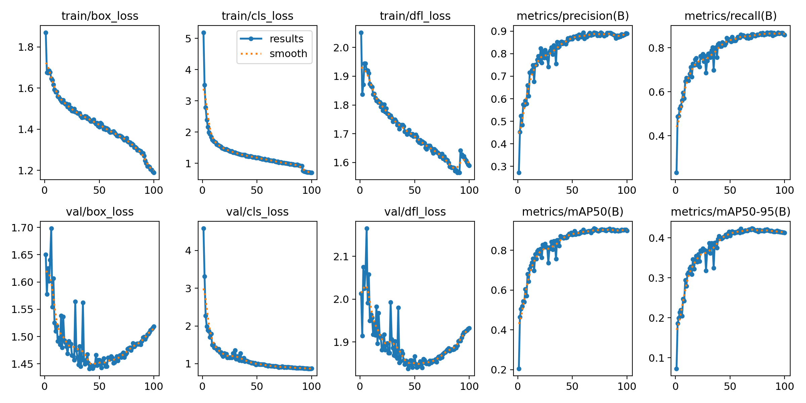
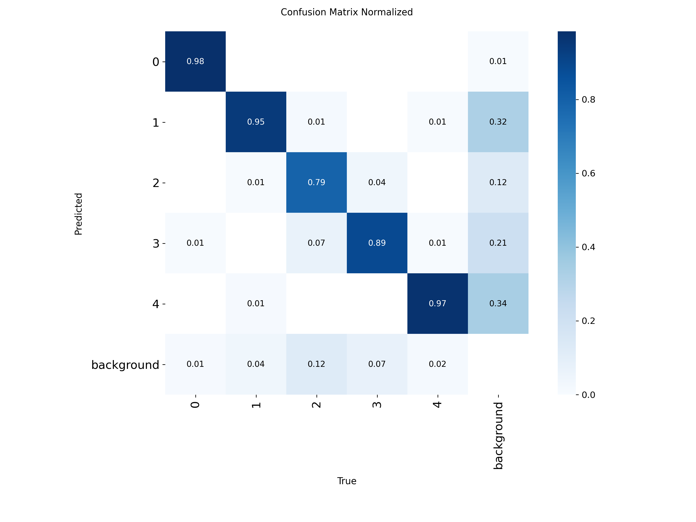

# Detección de Amenazas en Rayos X usando YOLO (Arquitectura 1)

## 1. Resumen
El objetivo de este trabajo práctico, es un modelo de visión por computadora capaz de detectar elementos peligrosos en escáneres de seguridad. Se priorizó una estrategia iterativa para mejorar la sensibilidad (**Recall**) del modelo, bajo la premisa operativa de que **"es preferible una falsa alarma (inspección manual) a dejar pasar una amenaza real"**.

El proceso evolucionó a través de tres experimentos principales:
1.  **Baseline + Augmentation:** Ajuste de variabilidad geométrica.
2.  **Oversampling:** Balanceo de clases mediante duplicación física.
3.  **Escalado de Modelo:** Cambio de arquitectura (Nano $\to$ Small).

---

## 2. Resultados Comparativos

A continuación se detalla la evolución de las métricas a través de las cuatro fases del proyecto.

| Experimento | Modelo | Recall (Max) | mAP@50 | mAP@50-95 | Conclusión Técnica |
| :--- | :--- | :--- | :--- | :--- | :--- |
| **1. Augmentation** | YOLOv8n | 0.824 | 0.852 | 0.395 | Baseline estabilizado. |
| **2. Oversampling** | YOLOv8n | 0.841 | 0.868 | 0.408 | Mejora por fuerza bruta (volumen). |
| **3. Small Model** | YOLOv8s | **0.875** | 0.892 | **0.443** | Mejor equilibrio general. |
| **4. Hyperparameter** | **YOLOv8s** | 0.870 | **0.910** | 0.424 | **Máxima Precisión.** Convergencia rápida. |

### Decisión Final de Modelo
Para la puesta en producción, se selecciona el modelo del **Experimento 4**.
* **Justificación:** Aunque el Exp 3 tuvo un Recall marginalmente superior (+0.005), el Exp 4 ofrece un **mAP@50 superior (0.91 vs 0.89)**. Esto implica que el modelo final es más "confiable": sus cajas delimitan mejor el objeto y tiene menos oscilaciones, lo que facilita la inspección visual por parte de los operarios de seguridad.

---

## 3. Detalle de Experimentos

### Experimento 1: Data Augmentation (Baseline Mejorado)
**Hipótesis:** El modelo base sufría de sobreajuste. Se introdujo rotación (`degrees=15`) y volteo vertical (`flipud=0.5`) para simular la disposición caótica de objetos en bandejas.

**Resultados:** Se logró estabilizar la pérdida (`val/box_loss`), evitando que subiera al final del entrenamiento.

| Curvas de Aprendizaje | Matriz de Confusión |
| :---: | :---: |
| [](./Entrenamiento1/results.png) <br> [Ver imagen completa](./Entrenamiento1/results.png) | [](./Entrenamiento1/confusion_matrix_normalized.png) <br> [Ver imagen completa](./Entrenamiento1/confusion_matrix_normalized.png) |

---

### Experimento 2: Oversampling Físico
**Hipótesis:** La clase "elemento peligroso" estaba subrepresentada. Se utilizó un script para duplicar físicamente las imágenes de interés (`factor=2.0`), forzando al modelo a ver estos ejemplos con mayor frecuencia.

**Resultados:** Se observa una mejora incremental en todas las métricas. El modelo comienza a generalizar mejor sobre la clase minoritaria.

| Curvas de Aprendizaje | Matriz de Confusión |
| :---: | :---: |
| [](./Entrenamiento2/results.png) <br> [Ver imagen completa](./Entrenamiento2/results.png) | [](./Entrenamiento2/confusion_matrix_normalized.png) <br> [Ver imagen completa](./Entrenamiento2/confusion_matrix_normalized.png) |

En este caso se utilizó un script para duplicar físicamente los archivos. [Ver código del script de duplicación](#2-aumento-físico-de-datos-oversampling)

---

### Experimento 3: Arquitectura "Small" (Modelo Final)
**Hipótesis:** El modelo Nano (3.2M parámetros) alcanzó su límite de capacidad de abstracción. Se migró a la arquitectura Small (11.2M parámetros) manteniendo las mejoras de datos anteriores.

**Resultados:** Se alcanzó el máximo rendimiento histórico. El Recall subió a **0.875** y la precisión media (mAP@50) rozó el **0.90**.

| Curvas de Aprendizaje | Matriz de Confusión |
| :---: | :---: |
| [](./Entrenamiento3/results.png) <br> [Ver imagen completa](./Entrenamiento3/results.png) | [](./Entrenamiento3/confusion_matrix_normalized.png) <br> [Ver imagen completa](./Entrenamiento3/confusion_matrix_normalized.png) |

### Experimento 4: Optimización de Hiperparámetros (Genetic Evolution)
**Hipótesis:** Los hiperparámetros por defecto de YOLOv8 están optimizados para fotografías naturales (dataset COCO). Dado que las imágenes de rayos X poseen propiedades espectrales únicas (transparencia, densidad codificada en color), se postuló que una búsqueda genética de hiperparámetros (`Evolving`) encontraría una configuración matemática más eficiente.

**Metodología:**
Se ejecutó un proceso de evolución genética sobre el modelo **Small**, ajustando tasas de aprendizaje (`lr0`, `lrf`), ganancia de cajas (`box`), y parámetros de color (`hsv`). Se combinaron estos nuevos valores con la rotación geométrica validada en el Exp 1.

**Resultados:**
* **Precisión Récord:** Se alcanzó un **mAP@50 de 0.91**, superando por primera vez la barrera del 90%.
* **Convergencia Acelerada:** El modelo alcanzó su pico de rendimiento en la **época 69**, mucho antes que en los experimentos anteriores, demostrando una mayor eficiencia en el aprendizaje.
* **Recall Sostenido:** Se mantuvo la alta sensibilidad (~0.87) lograda en el experimento anterior, pero con una precisión de localización superior.

| Curvas de Aprendizaje | Matriz de Confusión |
| :---: | :---: |
| [](./Entrenamiento4/results.png) <br> [Ver imagen completa](./Entrenamiento4/results.png) | [](./Entrenamiento4/confusion_matrix_normalized.png) <br> [Ver imagen completa](./Entrenamiento4/confusion_matrix_normalized.png) |

---

## 4. Análisis Operativo: El Costo del Error

Para la implementación en producción, se ha definido un criterio de éxito basado en la asimetría del riesgo:

1.  **Minimización de Falsos Negativos (Prioridad Absoluta):**
    * Un Falso Negativo implica que una amenaza real no es detectada.
    * Con el modelo actual (**Exp 3**), hemos maximizado el Recall para reducir este riesgo al mínimo posible.

2.  **Tolerancia a Falsos Positivos:**
    * Un Falso Positivo (detectar un arma donde hay un objeto inofensivo) implica un costo operativo: el tiempo que tarda un agente en inspeccionar la valija manualmente.
    * **Conclusión:** Dado que la inspección manual es un procedimiento estándar y de bajo costo comparado con la seguridad del vuelo, el modelo se considera exitoso aunque genere algunas falsas alarmas, siempre que esto garantice la detección de amenazas reales.

## 5. Conclusión.

El paso del modelo Nano al Small, sumado a las técnicas de aumento de datos, ha resultado en un sistema robusto.

## Anexo A: Guía de Reproducción del Modelo Final

Este anexo detalla los pasos técnicos exactos para reproducir los resultados del **Experimento 3 (Modelo Small + Oversampling)**.

### 1. Preparación del Entorno

Asegurarse de tener las dependencias instaladas:

```bash
pip install ultralytics tqdm gdown
```

Bajar el dataset y descomprimir el dataset:

```bash
gdown 1IqPblTm7nmKFpHXtl4beopE_SajTBoI0
unzip kaggle-xray_baggage_scanner_anomaly_detection.zip
```

### 2. Aumento Físico de Datos (Oversampling)

Ejecutar este comando sobre la carpeta de entrenamiento (train) para duplicar la cantidad de ejemplos positivos (Factor 2.0).

```bash
python augment_class.py augment --path train --class_id 2 --factor 2
```

### 3. Entrenamiento del Modelo

Se utiliza la arquitectura YOLOv8 Small con hiperparámetros de `Data Augmentation` inyectados vía CLI para mejorar la robustez ante rotaciones y cambios de perspectiva.

```bash
yolo detect train \
  data=data.yaml \
  model=yolov8s.pt \
  epochs=100 \
  imgsz=416 \
  device=0 \
  workers=8 \
  degrees=15 \
  flipud=0.5 \
  scale=0.6 \
  close_mosaic=0
```

### 4. Validación

Para maximizar el Recall en un entorno de producción, se recomienda realizar la inferencia con un umbral de confianza reducido:

```
# Validación priorizando Recall (Minimizar Falsos Negativos)
yolo detect val model=runs/detect/train/weights/best.pt data=data.yaml conf=0.10
```

---

## Anexo B: Optimización de Hiperparámetros

Este anexo documenta el proceso de búsqueda genética utilizado en el **Experimento 4** y la configuración final resultante.

### 1. Script de Búsqueda Genética (Tuning)
---

## Anexo B: Optimización de Hiperparámetros

Este anexo documenta el proceso de búsqueda genética utilizado en el **Experimento 4** y la configuración final resultante.

### 1. Script de Búsqueda Genética (Tuning)
Para encontrar los valores óptimos, no se utilizaron los valores por defecto de COCO. Se ejecutó el siguiente script que utiliza algoritmos evolutivos para mutar los hiperparámetros durante 50 iteraciones, optimizando la métrica de *fitness* (una combinación ponderada de mAP y Recall).

**Código de Ejecución (`tune_hyperparameters.py`):**

```python
from ultralytics import YOLO

def run_tuning():
    # Inicializamos con el modelo Small (punto de partida)
    model = YOLO('yolov8s.pt')

    # Ejecutamos la evolución
    # iterations=50: Probamos 50 combinaciones distintas
    # epochs=30: Cada prueba es corta para ahorrar tiempo
    model.tune(
        data='data.yaml',
        epochs=30,
        iterations=50,
        optimizer='AdamW',
        plots=False,
        save=False,
        val=False
    )

if __name__ == '__main__':
    run_tuning()

```

### 2. Configuración Maestra Final (final_config.yaml)

Se observa que la optimización redujo la saturación (hsv_s) y el brillo (hsv_v) respecto a los valores estándar, adaptándose a la paleta de colores de densidad de los escáneres. Se reintrodujo manualmente el volteo vertical (flipud) que el proceso automático había descartado, dado que es crítico para la operación real.

```yaml
task: detect
mode: train
model: yolov8s.pt      # Modelo Small
data: data.yaml        # Dataset de Rayos X
epochs: 100
patience: 100
batch: 16
imgsz: 416
device: 0
workers: 8
close_mosaic: 0        # Mantenemos variabilidad hasta el final

# --- Hiperparámetros Optimizados (Genetic Evolution) ---
lr0: 0.00924           # Tasa de aprendizaje inicial
lrf: 0.00823           # Tasa final (Decay suave)
momentum: 0.8567
weight_decay: 0.00046  # Menor regularización que el default
warmup_epochs: 3.95
box: 5.33              # Ganancia de la pérdida de caja
cls: 0.805
dfl: 1.47
hsv_h: 0.014           # Variación de matiz
hsv_s: 0.9             # Saturación ajustada
hsv_v: 0.45            # Valor (brillo) ajustado

# --- Mejoras Geométricas Manuales  ---
degrees: 15.0          # Rotación +/- 15°
flipud: 0.5            # Volteo vertical (50%)
fliplr: 0.5            # Volteo horizontal (50%)
scale: 0.5             # Escalado +/- 50%
mosaic: 1.0            # Activado
mixup: 0.1             # Leve transparencia para simular superposición
```

### 3. Comando de Entrenamiento Final

```bash
yolo detect train cfg=final_config.yaml name=Experimento4_Final
```
