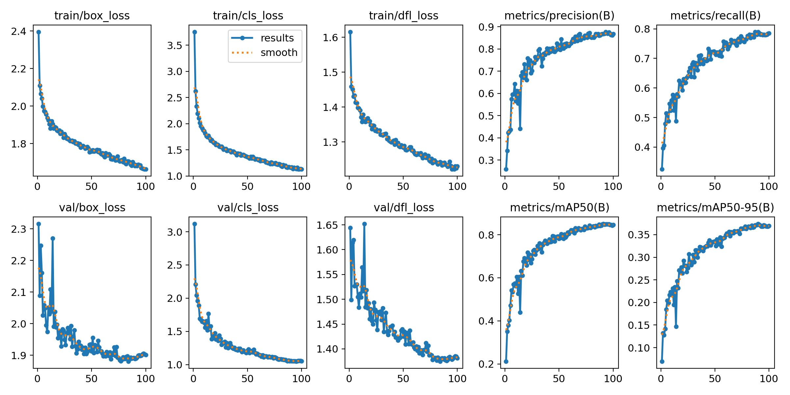
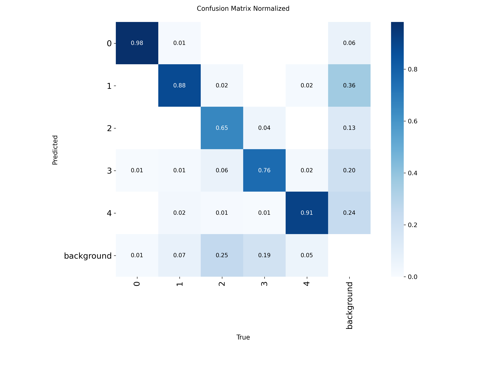
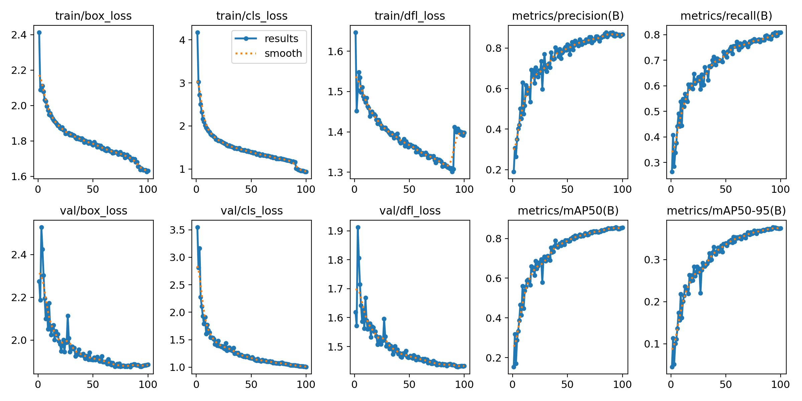
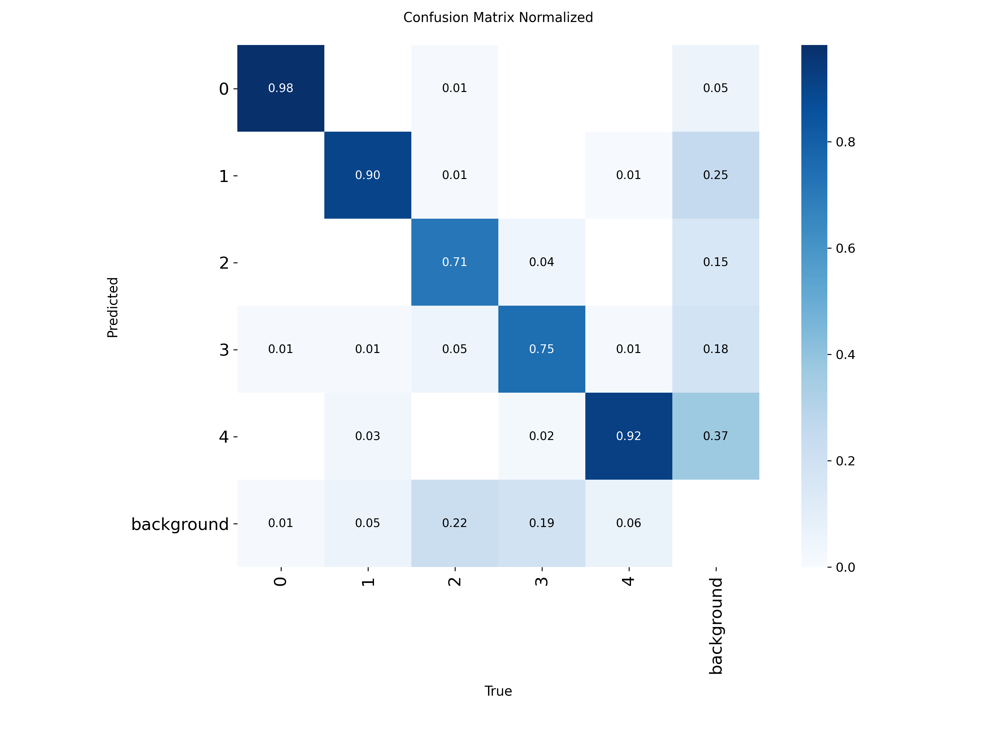
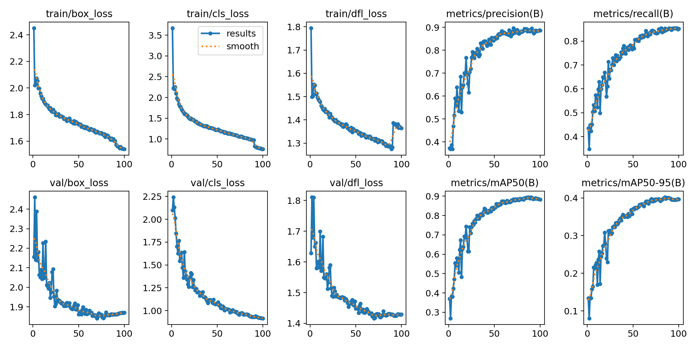
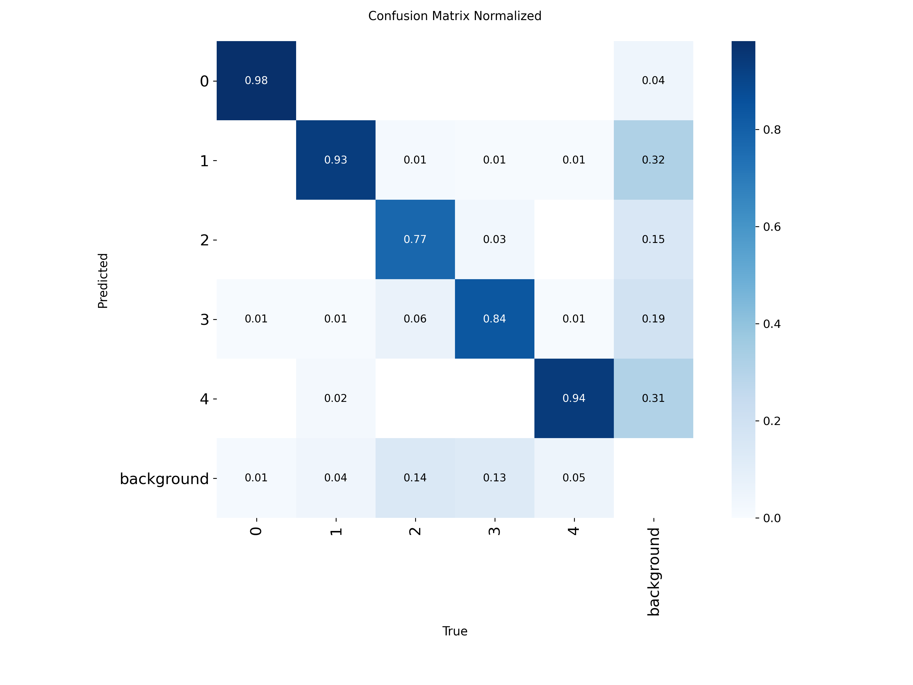

# Detección de Amenazas en Rayos X usando YOLO (Arquitectura 1)

## 1. Resumen
El objetivo de este trabajo práctico, es un modelo de visión por computadora capaz de detectar elementos peligrosos en escáneres de seguridad. Se priorizó una estrategia iterativa para mejorar la sensibilidad (**Recall**) del modelo, bajo la premisa operativa de que **"es preferible una falsa alarma (inspección manual) a dejar pasar una amenaza real"**.

El proceso evolucionó a través de tres experimentos principales:
1.  **Baseline + Augmentation:** Ajuste de variabilidad geométrica.
2.  **Oversampling:** Balanceo de clases mediante duplicación física.
3.  **Escalado de Modelo:** Cambio de arquitectura (Nano $\to$ Small).

---

## 2. Resultados Comparativos

A continuación se detallan las métricas máximas alcanzadas en cada iteración.

| Experimento | Modelo | Recall (Max) | mAP@50 | mAP@50-95 | Observación |
| :--- | :--- | :--- | :--- | :--- | :--- |
| **1. Augmentation** | YOLOv8n | 0.824 | 0.852 | 0.395 | Control inicial del overfitting. |
| **2. Oversampling** | YOLOv8n | 0.841 | 0.868 | 0.408 | Mejora consistente por volumen de datos. |
| **3. Small Model** | **YOLOv8s** | **0.875** | **0.892** | **0.443** | **Salto de calidad significativo.** |

---

## 3. Detalle de Experimentos

### Experimento 1: Data Augmentation (Baseline Mejorado)
**Hipótesis:** El modelo base sufría de sobreajuste. Se introdujo rotación (`degrees=15`) y volteo vertical (`flipud=0.5`) para simular la disposición caótica de objetos en bandejas.

**Resultados:** Se logró estabilizar la pérdida (`val/box_loss`), evitando que subiera al final del entrenamiento.

| Curvas de Aprendizaje | Matriz de Confusión |
| :---: | :---: |
| [](./Entrenamiento1/results.png) <br> [Ver imagen completa](./Entrenamiento1/results.png) | [](./Entrenamiento1/confusion_matrix_normalized.png) <br> [Ver imagen completa](./Entrenamiento1/confusion_matrix_normalized.png) |

---

### Experimento 2: Oversampling Físico
**Hipótesis:** La clase "elemento peligroso" estaba subrepresentada. Se utilizó un script para duplicar físicamente las imágenes de interés (`factor=2.0`), forzando al modelo a ver estos ejemplos con mayor frecuencia.

**Resultados:** Se observa una mejora incremental en todas las métricas. El modelo comienza a generalizar mejor sobre la clase minoritaria.

| Curvas de Aprendizaje | Matriz de Confusión |
| :---: | :---: |
| [](./Entrenamiento2/results.png) <br> [Ver imagen completa](./Entrenamiento2/results.png) | [](./Entrenamiento2/confusion_matrix_normalized.png) <br> [Ver imagen completa](./Entrenamiento2/confusion_matrix_normalized.png) |

En este caso se utilizó un script para duplicar físicamente los archivos. [Ver código del script de duplicación](#2-aumento-físico-de-datos-oversampling)

### Experimento 3: Arquitectura "Small" (Modelo Final)
**Hipótesis:** El modelo Nano (3.2M parámetros) alcanzó su límite de capacidad de abstracción. Se migró a la arquitectura Small (11.2M parámetros) manteniendo las mejoras de datos anteriores.

**Resultados:** Se alcanzó el máximo rendimiento histórico. El Recall subió a **0.875** y la precisión media (mAP@50) rozó el **0.90**.

| Curvas de Aprendizaje | Matriz de Confusión |
| :---: | :---: |
| [](./Entrenamiento3/results.png) <br> [Ver imagen completa](./Entrenamiento3/results.png) | [](./Entrenamiento3/confusion_matrix_normalized.png) <br> [Ver imagen completa](./Entrenamiento3/confusion_matrix_normalized.png) |

---

## 4. Análisis Operativo: El Costo del Error

Para la implementación en producción, se ha definido un criterio de éxito basado en la asimetría del riesgo:

1.  **Minimización de Falsos Negativos (Prioridad Absoluta):**
    * Un Falso Negativo implica que una amenaza real no es detectada.
    * Con el modelo actual (**Exp 3**), hemos maximizado el Recall para reducir este riesgo al mínimo posible.

2.  **Tolerancia a Falsos Positivos:**
    * Un Falso Positivo (detectar un arma donde hay un objeto inofensivo) implica un costo operativo: el tiempo que tarda un agente en inspeccionar la valija manualmente.
    * **Conclusión:** Dado que la inspección manual es un procedimiento estándar y de bajo costo comparado con la seguridad del vuelo, el modelo se considera exitoso aunque genere algunas falsas alarmas, siempre que esto garantice la detección de amenazas reales.

## 5. Conclusión.

El paso del modelo Nano al Small, sumado a las técnicas de aumento de datos, ha resultado en un sistema robusto.

## Anexo A: Guía de Reproducción del Modelo Final

Este anexo detalla los pasos técnicos exactos para reproducir los resultados del **Experimento 3 (Modelo Small + Oversampling)**.

### 1. Preparación del Entorno

Asegurarse de tener las dependencias instaladas:

```bash
pip install ultralytics tqdm gdown
```

Bajar el dataset y descomprimir el dataset:

```bash
gdown 1IqPblTm7nmKFpHXtl4beopE_SajTBoI0
unzip kaggle-xray_baggage_scanner_anomaly_detection.zip
```

### 2. Aumento Físico de Datos (Oversampling)

Ejecutar este comando sobre la carpeta de entrenamiento (train) para duplicar la cantidad de ejemplos positivos (Factor 2.0).

```bash
python augment_class.py augment --path train --class_id 2 --factor 2
```

### 3. Entrenamiento del Modelo

Se utiliza la arquitectura YOLOv8 Small con hiperparámetros de `Data Augmentation` inyectados vía CLI para mejorar la robustez ante rotaciones y cambios de perspectiva.

```bash
yolo detect train \
  data=data.yaml \
  model=yolov8s.pt \
  epochs=100 \
  imgsz=416 \
  device=0 \
  workers=8 \
  degrees=15 \
  flipud=0.5 \
  scale=0.6 \
  close_mosaic=0
```

### 4. Validación

Para maximizar el Recall en un entorno de producción, se recomienda realizar la inferencia con un umbral de confianza reducido:

```
# Validación priorizando Recall (Minimizar Falsos Negativos)
yolo detect val model=runs/detect/train/weights/best.pt data=data.yaml conf=0.10
```
