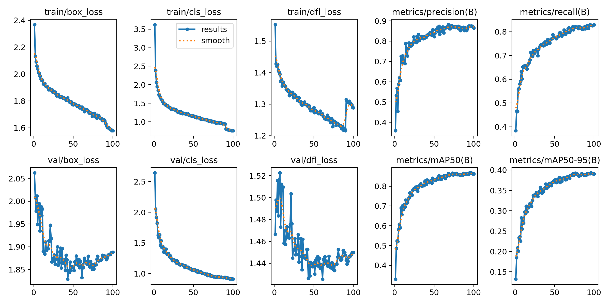

## Baseline

Siguiendo el espíritu de la propuesta, se buscó una alternativa que permitiera encontrar rápidamente valores de detección para establecer un **Baseline** sobre el cual iterar y mejorar.

### Se realizó un caso de Transfer Learning de manual

  * **Se tomó un modelo "experto":** `yolov8n.pt`, que ya sabe "ver" (identificar bordes, texturas, formas, objetos).
  * **Se le dio una nueva tarea específica:** Se le mostraron imágenes de rayos X y se le indicó: "De todo lo que sabés ver, esto de acá es un 'elemento peligroso'".
  * **Se hizo "Fine-Tuning":** El modelo reajustó sus "neuronas" finales para especializarse en esta tarea, sin tener que aprender a ver desde cero.

### ¿Cuál es el dataset de pre-entrenamiento?

El modelo utilizado (`yolov8n.pt`) está pre-entrenado en el dataset **COCO (Common Objects in Context)**. Es uno de los datasets de detección de objetos más grandes y estándar de la industria. Contiene cientos de miles de imágenes cotidianas.

Tiene 80 clases de objetos comunes, como:

  * personas, autos, motos, bicicletas, etc.
  * perros, gatos, pájaros, caballos, etc.
  * botellas, sillas, sofás, monitores, teclados, etc.
  * semáforos, señales de stop, parquímetros, etc.

### Ejecución del Entrenamiento

El entrenamiento se ejecutó en una consola de una computadora con Linux, utilizando el siguiente comando:

`$ yolo detect train data=data.yaml model=yolov8n.pt epochs=100 imgsz=416 device=0`

Dado que nuestro dataset ya contaba con el archivo `data.yaml` y la estructura de directorios correcta para YOLO, el comando se ejecutó sin ningún contratiempo. Se puede observar que los únicos **parámetros** que se pasaron a la línea de comandos fueron la cantidad de **épocas** (100), el **tamaño de la imagen** (416x416) y el **dispositivo** a utilizar (device=0, la GPU).

A continuación, se presenta la arquitectura del modelo (`yolov8n`):

```text
                   from  n    params  module                                       arguments
  0                  -1  1       464  ultralytics.nn.modules.conv.Conv             [3, 16, 3, 2]
  1                  -1  1      4672  ultralytics.nn.modules.conv.Conv             [16, 32, 3, 2]
  2                  -1  1      7360  ultralytics.nn.modules.block.C2f             [32, 32, 1, True]
  3                  -1  1     18560  ultralytics.nn.modules.conv.Conv             [32, 64, 3, 2]
  4                  -1  2     49664  ultralytics.nn.modules.block.C2f             [64, 64, 2, True]
  5                  -1  1     73984  ultralytics.nn.modules.conv.Conv             [64, 128, 3, 2]
  6                  -1  2    197632  ultralytics.nn.modules.block.C2f             [128, 128, 2, True]
  7                  -1  1    295424  ultralytics.nn.modules.conv.Conv             [128, 256, 3, 2]
  8                  -1  1    460288  ultralytics.nn.modules.block.C2f             [256, 256, 1, True]
  9                  -1  1    164608  ultralytics.nn.modules.block.SPPF            [256, 256, 5]
 10                  -1  1         0  torch.nn.modules.upsampling.Upsample         [None, 2, 'nearest']
 11             [-1, 6]  1         0  ultralytics.nn.modules.conv.Concat           [1]
 12                  -1  1    148224  ultralytics.nn.modules.block.C2f             [384, 128, 1]
 13                  -1  1         0  torch.nn.modules.upsampling.Upsample         [None, 2, 'nearest']
 14             [-1, 4]  1         0  ultralytics.nn.modules.conv.Concat           [1]
 15                  -1  1     37248  ultralytics.nn.modules.block.C2f             [192, 64, 1]
 16                  -1  1     36992  ultralytics.nn.modules.conv.Conv             [64, 64, 3, 2]
 17            [-1, 12]  1         0  ultralytics.nn.modules.conv.Concat           [1]
 18                  -1  1    123648  ultralytics.nn.modules.block.C2f             [192, 128, 1]
 19                  -1  1    147712  ultralytics.nn.modules.conv.Conv             [128, 128, 3, 2]
 20             [-1, 9]  1         0  ultralytics.nn.modules.conv.Concat           [1]
 21                  -1  1    493056  ultralytics.nn.modules.block.C2f             [384, 256, 1]
 22        [15, 18, 21]  1    752287  ultralytics.nn.modules.head.Detect           [5, [64, 128, 256]]
Model summary: 129 layers, 3,011,823 parameters, 3,011,807 gradients, 8.2 GFLOPs
```

Tardó aproximadamente **1 hora y 20 minutos** en completar las 100 épocas utilizando una NVIDIA GeForce GTX 1660 SUPER (5748MiB).

### Resultados



Todas las curvas `train/` (fila de arriba) bajan, y las métricas `metrics/` (fila de la derecha) suben. Esto es un buen **síntoma**.

**La clasificación es muy buena:** Observando el gráfico `val/cls_loss` (fila de abajo, segundo), se ve una curva casi perfecta que baja y se aplana. Esto nos dice que el modelo se volvió capaz de identificar nuestro "elemento peligroso", distinguiéndolo bien del fondo.

**Las Métricas son Altas:**

  * `metrics/mAP50(B)`: Llega casi a **0.85**. Esta es una gran métrica. Con un criterio de "superposición del 50%" (IoU), el modelo acierta el 85% de las veces.
  * `metrics/mAP50-95(B)`: Llega a **0.40 (o 40%)**. Esta es la métrica principal y más estricta (promedia todos los IoU de 50% a 95%). Un 40% en un dataset *custom* es un muy buen punto de partida (baseline).

El punto clave de análisis es el gráfico `val/box_loss` (fila de abajo, primero):

  * **De época 0 a \~75:** La curva baja. El modelo está aprendiendo a dónde dibujar la caja (bounding box) en las imágenes de validación.
  * **De época \~75 a 100:** La curva empieza a subir de nuevo.

Es un claro ejemplo de **sobreajuste (overfitting)**.

### Siguientes pasos

Dado que no se dispone de nuevos datos, los siguientes pasos se centrarán en mitigar el sobreajuste. Se puede recurrir a un **Data Augmentation** más agresivo (giros verticales, **rotación**, zoom) y utilizar un **WeightedRandomSampler**, como se planteó en el EDA (Análisis Exploratorio de Datos).
